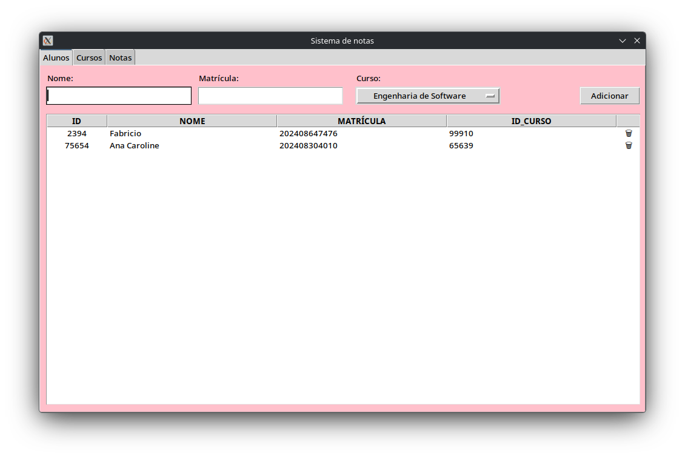
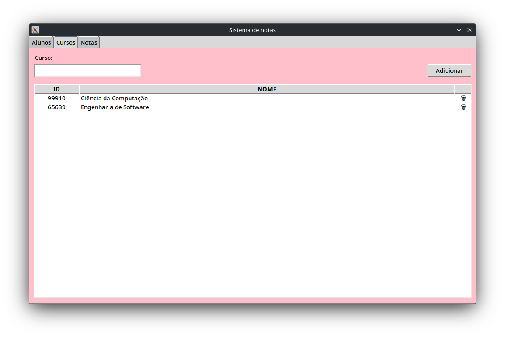
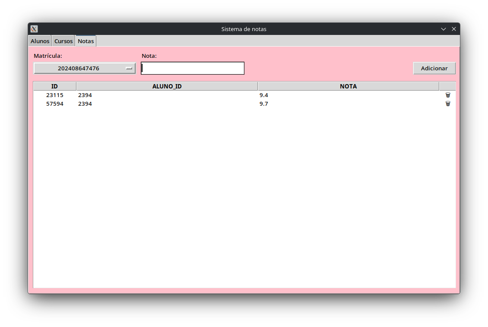

# Sistema de Notas
Projeto final da matéria de Desenvolvimento Rápido de Aplicações em Python do curso de Ciência da Computação. Criação de uma interface gráfica para gerenciamento de alunos, cursos e notas.

## Pre-requisitos

1. Postgresql
2. psycopg2

## Executando

```
$python app.py
```

## Screenshots





## Autores

* **Fabrício** - [FabricioLR](https://github.com/FabricioLR)
* **Ana Caroline** - [anac-roline](https://github.com/anac-roline)